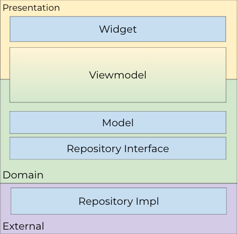

# url_alias

An application that allows you to shorten links and displays a
history of the recently shortened links to your favorite websites. 

App example with flutter_bloc and automated testing (unit and widget).

## Getting Started

This project is a starting point for a Flutter application.

A few resources to get you started if this is your first Flutter project:

- [Lab: Write your first Flutter app](https://docs.flutter.dev/get-started/codelab)
- [Cookbook: Useful Flutter samples](https://docs.flutter.dev/cookbook)

## App Architecture

It's a MVVM using some principles of SOLID to make the application flexible.

Here's an overview of the layers:



Viewmodel is between two layers because it's the glue between Presentation and Domain.

## Run app
flutter run

## Testing

Our test coverage is a mixing between unit and widget testing.

**To run**:
```
flutter test
```
**To check coverage**(you'll need lcov):
```
rm -rf coverage/ && flutter test --coverage && sleep 2 && genhtml -o coverage coverage/lcov.info
```
This command will generate the coverage report and also print the coverage in the console.

You can learn more about Widget Testing here:
- [Introduction to Widget Testing](https://flutter.dev/docs/cookbook/testing/widget/introduction)

## Dependencies

# flutter_bloc: ^9.1.1
    -Used to separate presentation from business logic. Following the BLoC pattern facilitates testability and reusability.
    - Dart Package: <https://pub.dev/packages/bloc>
    - GitHub: <https://github.com/felangel/bloc>
    - License: [MIT](https://github.com/felangel/bloc/blob/master/LICENSE)

  # equatable: ^2.0.7
    -Comparsion simplified.
    - Dart Package: <https://pub.dev/packages/equatable>
    - GitHub: <https://github.com/felangel/equatable>
    - License: [MIT](https://pub.dev/packages/equatable/license)

  # mocktail: ^1.0.4
    -Mock package inspired by Mockito for Null Safety apps.
    - Dart Package: <https://pub.dev/packages/mocktail>
    - GitHub: <https://github.com/felangel/mocktail>
    - License: [MIT](https://pub.dev/packages/mocktail/license)
  
  # bloc_test: ^10.0.0
    -Easy way to test blocs and cubits.
    - Dart Package: <https://pub.dev/packages/bloc_test>
    - GitHub: <https://github.com/felangel/bloc/tree/master/packages/bloc_test>
    - License: [MIT](https://pub.dev/packages/bloc_test/license)

  # http: ^1.5.0
    -A composable, Future-based library for making HTTP requests.
    - Dart Package: <https://pub.dev/packages/http>
    - GitHub: <https://github.com/dart-lang/http/tree/master>
    - License: [BSD-3-Clause](https://pub.dev/packages/http/license)

